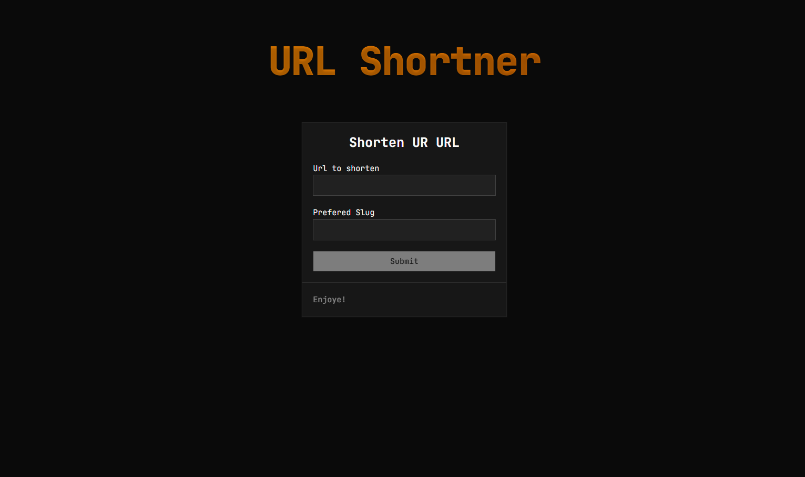

# URL SHORTNER: With Unique Experiance

Built with ❤️ for Everyone

<p align="center">
  <a href="https://hackclub.com" target="_blank">
    
  </a>
  <a href="https://shrotururl.vercel.app/" target="_blank">
    
  </a>
</p>




> This website is used to short url. It's open source you can generate as many as you want. Use it give feedbacks and also a ⭐ on github.

## Tech Stack 
- Nextjs
- React 
- Shadcn UI
- Mongodb

## How to use
First you need to install git in your system through this page you can download and install [git](https://git-scm.com/install/).

Then you can run this command to `clone` this repo code

```bash
git clone https://github.com/ahmadsiddique-dev/shortner.git
```

and then you have to change directory and install dependencies for that you can run this 

```bash
npm i 
```

when you are done with installation of dependencies run your development server like this 

```bash
npm run dev 
```

got to browser and type 

```scratch
http://localhost:3000
```

Please give feedbacks for improvement we will work on it and like to hear from you. Please don't forget to give a ⭐ 
